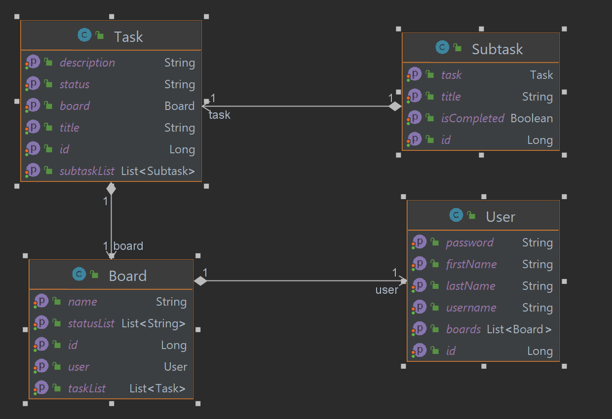

# 🍃 Kanban Task Management Application : Back-End Module
## Overview 
A Kanban Task Management Application is a comprehensive project aimed at building a robust task management system. It integrates a Spring-based backend for server-side functionalities and a React-based frontend for an intuitive user interface. Embracing a Test-Driven Development (TDD) approach, the project ensures reliability and stability throughout the development lifecycle.

   

## Project Structure
```markdown
C:.
├───main
│   ├───java
│       └───com
│           └───slimanice
│               └───kanbantaskmanagementapp
│                   ├───configuration       => contains configuration classes
│                   ├───dto                 => contains data transfer objects
│                   ├───entity              => contains entity classes
│                   ├───exception           => contains exception classes
│                   ├───mapper              => contains mapper classes
│                   ├───repository          => contains repository classes
│                   ├───service             => contains service classes
│                   └───web                 => contains web classes
└───test
    └───java
        └───com
            └───slimanice
                └───kanbantaskmanagementapp => contains test classes
```     

## Technologies & Dependencies
The project utilizes various dependencies managed through Maven, including:

| Dependency      | Use Case                                                                                               |
|-----------------|--------------------------------------------------------------------------------------------------------|
| Spring Web      | Build RESTful Web Service                                                                              |
| Spring Data JPA | Persist Data in SQL stores with Java Persistence API using Spring Data and Hibernate                   |
| PostgreSQL      | Open-Source Relational Database Management System                                                      |
| Lombok          | Never write another getter or equals method again, with one annotation                                 |
| Actuator        | Monitor and manage your application                                                                    |
| DevTools        | Provides fast application restarts, LiveReload, and configurations for enhanced development experience |
| Starter Test    | Unit test your application with Spring Boot support                                                    |


## Database Schema


## 🔮 Future Scope :
Future iterations of the application may include:

1. 🤝 Real-time Collaboration: Implementing features for real-time collaboration on tasks among multiple users.
2. 🌟 Enhanced User Experience: Continual refinement of the user interface and user experience based on user feedback.
3. 📊 Advanced Analytics: Introducing analytics and reporting features to track productivity and task progress.
## Conclusion
The Kanban Task Management Application strives to offer a comprehensive and user-friendly task management solution by leveraging the capabilities of Spring and React while adhering to the best practices of Test-Driven Development for reliability and scalability.